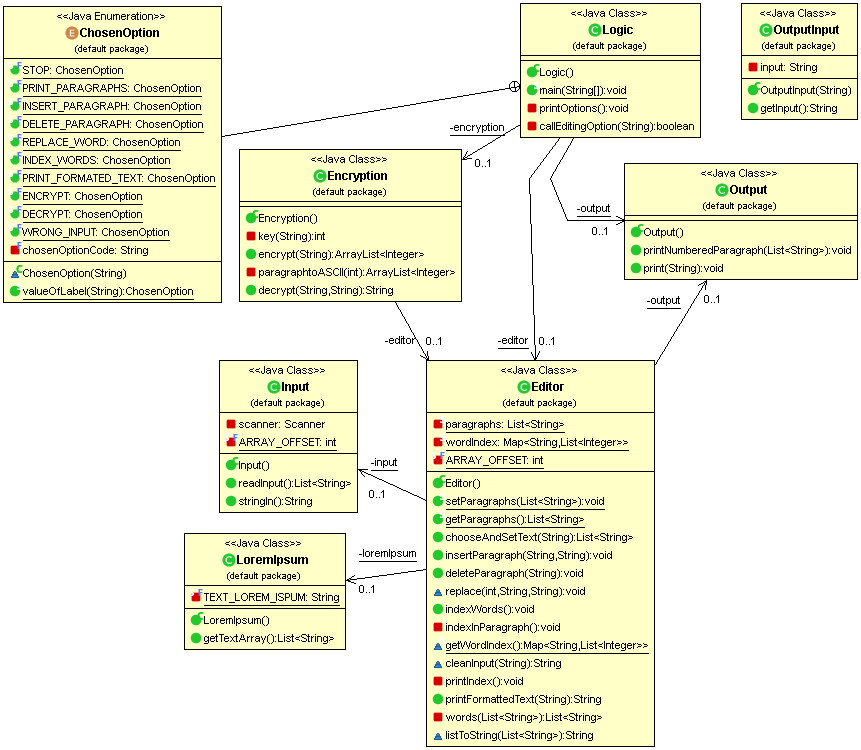

# gruppe103-CaffeineAddicts-projekt2-editor

# Text Editor

Terminal Text Editor

## Getting Started

Das Projekt wurde ine Eclipse und IntelliJ getestet und funktioniert über den Terminal.

## Funktionen des Programms

Wenn Sie das Programm starten können Sie ihren Text kopieren und vollständig in den Terminal kopieren.
Um dem Programm das Ende des Textes zu signalisieren geben Sie "END" ein.

Bearbeitungsmöglichkeiten für ihren Text:

1: Print paragraphs - Gibt alle Paragraphen nummeriert im Terminal aus.

2: Insert paragraph - Sie können einen Paragraphen an der von Ihnen gewünschten Stelle einfügen.

3: Delete paragraph - Sie können einen Paragraphen an der von Ihnen gewünschten Stelle löschen.

4: Replace - Ein Wort suchen und dieses durch ein anderes Wort ersetzten.

5: Index Words - Gibt eine Liste mit allen Worten, welche mindestens zwei mal vorkommen, zurück. Inklusive Paragraphen Nummer.

6: Print formated text - Gibt den Text im Terminal zurück. Sie können die Zeilenlänge bestimmen.

## Team

* **Pascal Witzig** - Head of Development of Wordindexing aka Assistant Caffeine Addict

* **Oliver Corrodi** - Director of Code testing aka Chief Caffeine and Nicotine Addict

* **Erman Zankov** - First Executive Programmer specialized in replace, insert, delete and numbering paragraphs aka Longboi

* **Tobias Ritscher** - Senior Software Engineer in Logic Departement aka Diseased Penguin

## License

This project is licensed under the ZHAW License - see [ZHAW](http://www.zhaw.ch) for details

## Class Diagram

